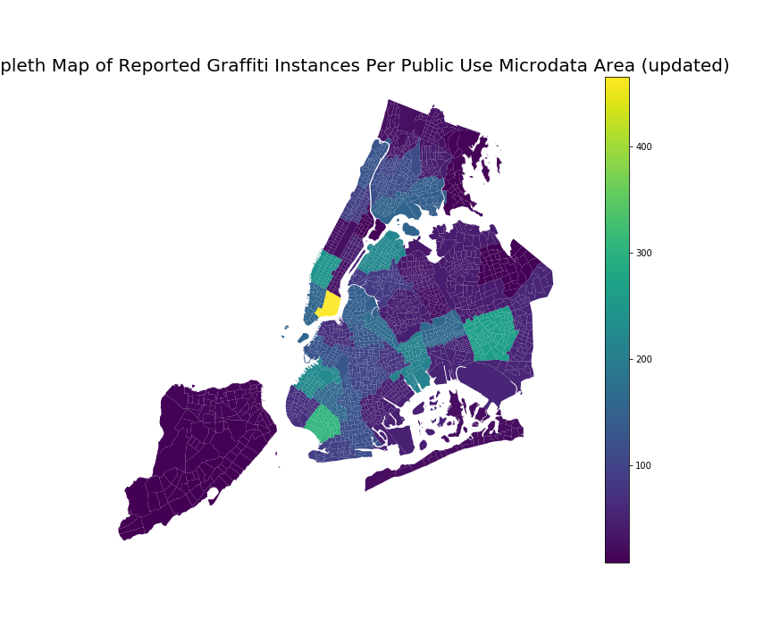

# Homework 11

## Assignment 1 - Subway Timeseries
This homework assignment was very long and challenging in different ways. I spent a few of days working at CUSP with different groups. For the initial part of the assignment, I worked with QY (qg412), and Sam (sjf374). We examined the initial data cube together and talk through different ways of looking at the data/ segemnt/ method of attack. Then for the next two tasks, I worked with QY (qg412), Sam (sjf374), Jerome (jl9489), Andrea(ah4412), and Fekade Brook (fb1182). Mainly, we worked alongside each other thinking out loud and comparing outputs.

## Assignment 2 - Redo Plot from Homework 8 Assignment 1 with Inputs from Classmates
For this assignment, I worked by myself to make a redo the plot from homework 8 incorportating the comments from my classmates ah4412 and jz3525 using a dataset I found interesting from the NYC Open Data portal. 

Fig 1: Showing a chloropleth map of New York City with the colors representing the count of graffiti reported per PUMA area.