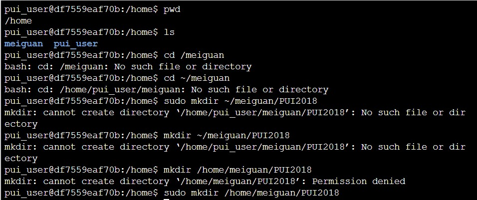
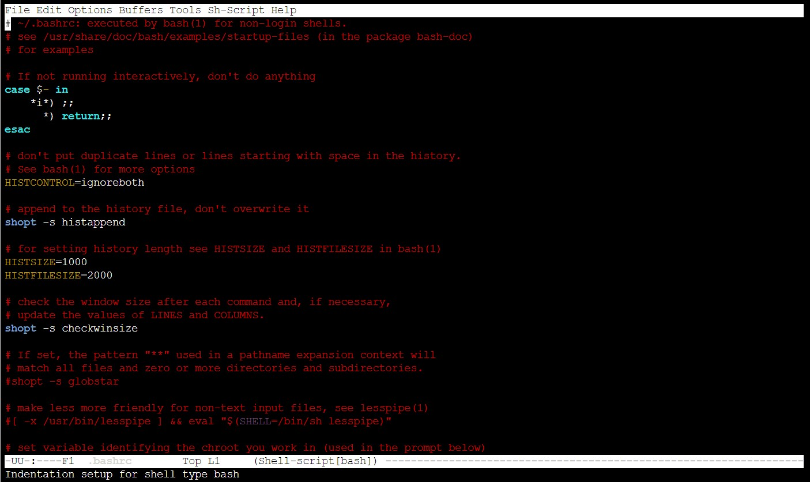
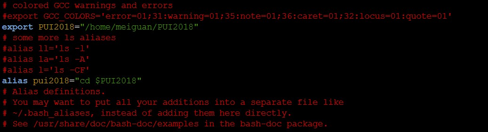
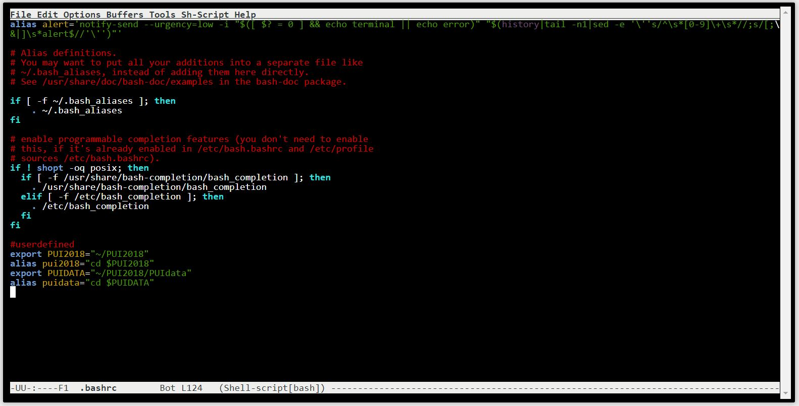
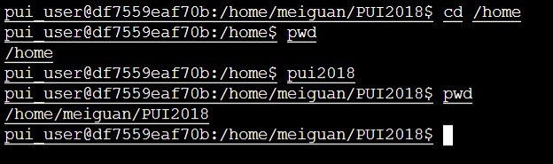

## Creating Evnvironmental Variables

This was completed initially via the Docker container method introduced in week 1 of the PUI 2018 class and then subsequently reproduced in CUSP's ADRF during week 2 of the class.

Steps to create environmental variables:

1) make a new directory named PUI2018

2) make sure you know the path to the PUI2018 directory. then open the emacs editor for the bash file. The bash file looks as follow:

Then go to the lines where you can export and create an alias:

export PUI2018="~/PUI2018"
alias pui2018="cd $PUI2018"
export PUIDATA="~/PUI2018/PUIdata"
alias puidata="cd $PUIDATA"

3) Save and exit the bash file using control x , control c and y

4) source the bashfile using using source ~/.bashrc

5) Check the variables using pwd, pui2018, pwd
