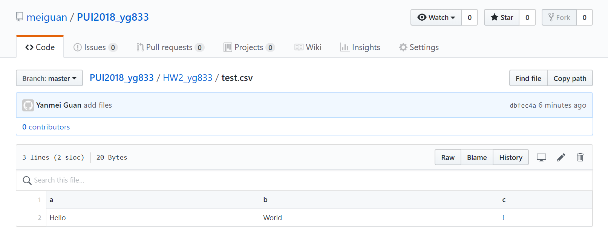
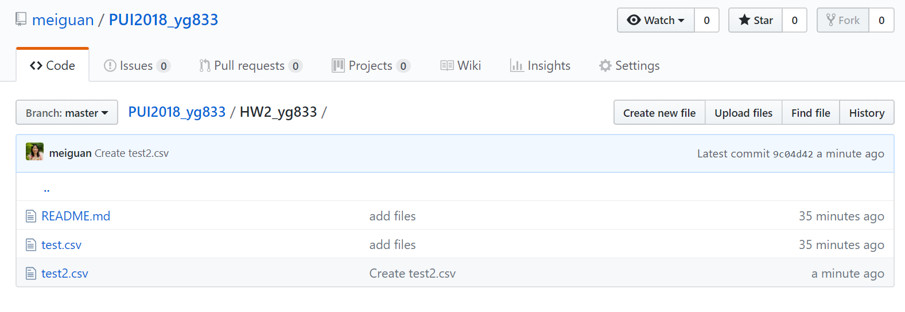
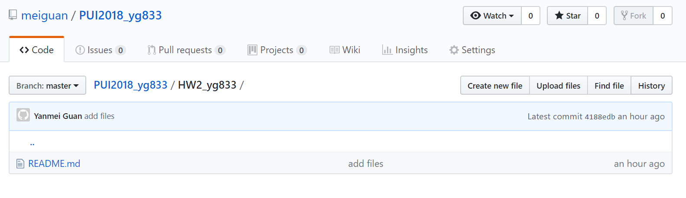

# Homework 2

Homework partnership with Sam Falk - 
read through the directions for 

This was week 3 of the course but the second homeowrk assignment submitted via github

## Part 1: perform the instruction in deleteData.md: delete data and its history from a GitHub repo

1) Created a test.csv file in my repo locally and pushed it to github

2) Creates a test2.csv file via the text editor on Github and pulled the changes

3) deleted the files and its history

4) forced the changes to the origin

## Part 2: Choose a file in CSV format from NYC Open Data and use pandas to read the file and mangle the data within it.

## Part 3: Write scripts to stream real-time bus data from MTA through the MTA Bus Time interface. In order to access this data, you must first request an API key from MTA.
