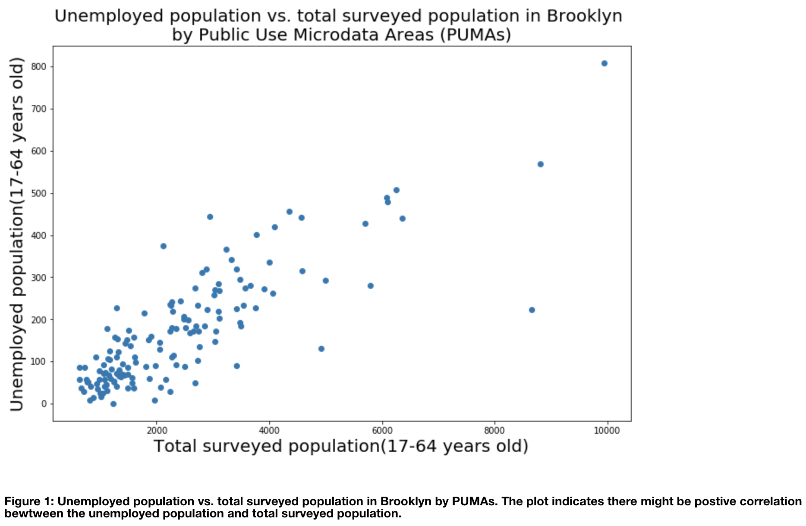

## Assignment 1: Review of LuJunru's Plot Assignment from HW8

This is a peer review of my colleague LuJunru's plot assignment from [homework 8](https://github.com/LuJunru/PUI2018_lj1230/tree/master/HW8_lj1230)

LuJunru used the unemployment data from ACS 2015 that is found on [FB55's Carto](https://nyu.carto.com/tables/acs15/public) And plotted unemployed population vs. total surveyed population in Brooklyn by PUMAs.

The resulting plot rendered below:

In general, I like the simplicity of the resultant plot. It is communicating 1 idea and 1 relationship between Unemployed Population ages 17 to 64 vs. Total Surveyed Population ages 17 to 64 in Brooklyn per Public Use Microdata Area(PUMA). I think the choice of using a scatterplot is appropriate for the visualization of the 2 variables of interest. And I think the resultant is a honest reproduction of the ACS 15 unemployment data. 

However, after reviewing the plot and the two variables, I am wondering what is actionable from this visualization. The plot shows a positive trend depicting a positive correlation between unemployment populations and the surveyed population. Is this the only message to be communicated? What if we were to layer in some color differences for median household income averages per PUMA or rent burdened households?  